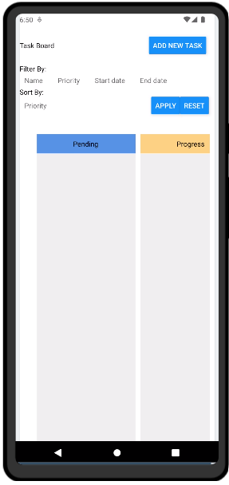
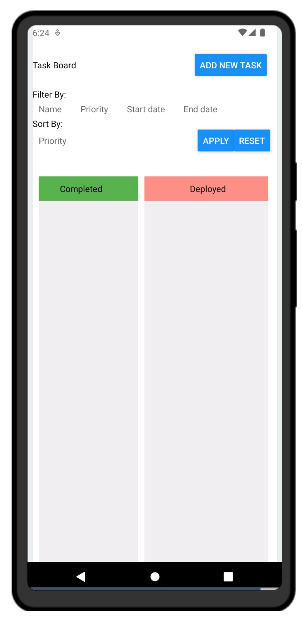
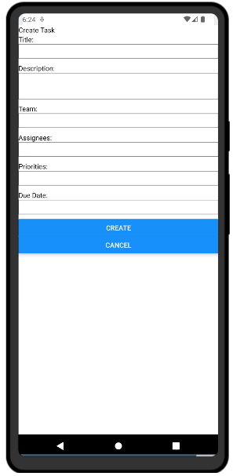
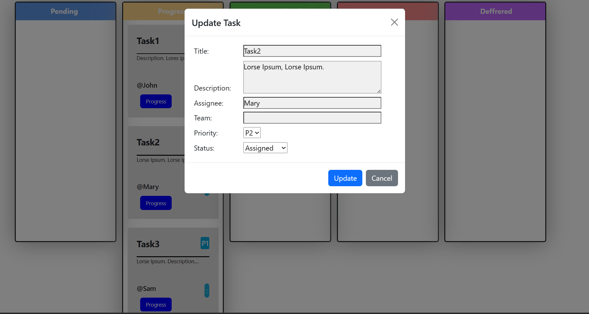
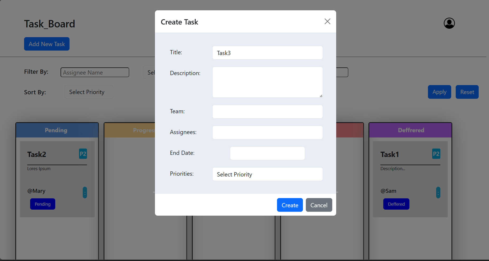

# Project Planner App

This project consists of a Task Tracker application developed using both React JS and React Native. While the React JS version is fully functional and can be directly used from this repository, the React Native version was developed using an online compiler. As a result, some of the required packages and dependencies might not be readily available, requiring additional setup steps.
## Available Scripts

### Features - 

React JS Version: A fully functional task tracker app.\
React Native Version: A task tracker app developed using React Native for android users (some setup required). It works with limited functionalities as compared to React js counterpart.

### Libraries Used

Reactstrap: Used in the React JS version to provide functionalities for the modal form.

### Assumptions and Recommendations

The app assumes that each task title is unique.\
After performing filter or sorting operations, it is recommended to reset the workspace to avoid potential data loss due to consecutive operations.

### Contributing
Feel free to open an issue or submit a pull request for any improvements or suggestions.

# Images

 
 

